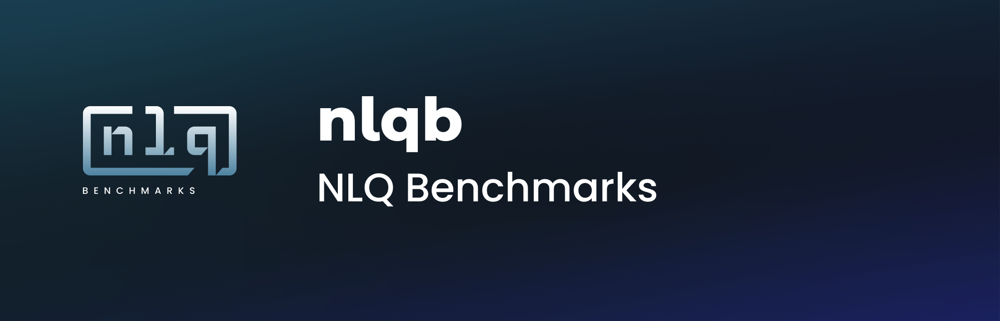

<table border="0" style="width: 100%">
 <tr>
    <th style="width:40%;font-size:30px">LLM Text-to-SQL Benchmark</b></th>
    <th style="width:20%;font-size:30px">Current Leaderboard</b></th>
 </tr>
 <tr>
    <td>
    NLQB is a free and open source benchmark that enables evaluation and comparison of Text-to-SQL solutions. It expands on an industry standard benchmark for database performance called TPC-DS as well as 3rd party research on LLMs. The motivation is to provide an objective, quantitative method to evaluate text-to-sql solutions on a “level playing field” with the same inputs. 

This repo has been created to do 3 things.
1. Host the material for a public benchmark, including a dataset, evaluation questions, and evaluation method 
2. Host a performance leaderboard to show how text-to-sql solutions compare to each other
3. Enable the community to submit an entry or suggest changes to the benchmark

This repo will serve as the hosting site for this leaderboard, as well as the distribution place for any related resources. In the sections below, you'll find links to getting the data, as well as information on how to test and verify AtScale's current Text-to-SQL solution. We look forward to seeing all the great solutions folks can come up with!

## Getting the Data

For this benchmark, we used the open source Decision Support dataset provided by the Transaction Processing Performance Council, also called the [TPC-DS](https://www.tpc.org/tpcds/). This dataset is widely used for data warehousing performance benchmarks meant to simulate the proprietary data of a real-world retail company. The dataset includes roughly two dozen tables, and supports a wide range of data volumes depending on customer needs. For the sake of evaluating Text-to-SQL solutions, we will use one of the smaller data volumes. 

To access this data, you have a few options. Snowflake, Databricks, and Google users can access the data using the free methods described on [this page](https://github.com/semanticdatalayer/sml-models-tutorials-tpcds?tab=readme-ov-file#data-loading-instructions). This page also has information on how to access and use the AtScale community edition if you would like to try and replicate our Text-to-SQL results. Alternatively, most data warehouses either provide this data as part of their publicly sample datasets, or have official documentation/loaders to populate the relevant tables.

## The Question Set

The 40 questions for this benchmark cover a range of complexities based on this [data.world paper](https://arxiv.org/pdf/2311.07509). This method breaks the complexity into 2 axes:  
1. Question Complexity: gauges the complexity of the KPI the question is interested in
    * Low Complexity: simply selection of correct tables ie "Select x"
    * High Complexity: involves in query aggregations and mathematical functions 
2. Schema Complexity: translates to the number of tables the query requires 
    * Low Complexity: 0-4 tables
    * High Complexity: 4 or more tables, many-to-many joins

The questions themselves can be found in the [resources folder](resources/question_dict.json), and provide the questions complexity via the  'q_complexity' and 's_complexity' keys.

## KPI and Join Definitions

Within the question set you'll see references to KPIs like "total net profit". While many of these may be considered self-explanatory, from a businesses' perspective there is a single correct definition of each. Part of the LLM's task in Text-to-SQL workloads is to correctly define or reference these KPIs during query construction. 

Similarly, the question may reference data from multiple source tables. To correctly answer such a question, the LLM will need to know how the underlying tables interact to create the join statements.

As such, to correctly evaluate LLM performance we need a source of truth for these KPI definitions and table interactions. In this case we'll use the metadata from a [SML](https://github.com/semanticdatalayer/SML) based semantic model. This model will provide the definitions of all necessary KPIs, as well as describe the relationships required between all of the tables. 

The model in question is defined in [this repository](https://github.com/semanticdatalayer/sml-models-tutorials-tpcds). 

## Result Evaluation
Evaluation of this benchmark is done using full table equality of the query results. This is to account for the fact that there are cases where multiple queries can result in the same output table and be deemed correct. Evaluation based on the query itself could result in false negatives, where table evaluation should be more robust. 

However, the content of the TPC-DS data tables can be different depending on the download method or example size, and attempting to include all iterations of these query results in the repo was deemed unrealistic. Instead, an example of a valid result query is included in the [question dictionary](resources/question_dict.json). Please not that these results operate under the assumption that **all columns involved in any part of the query will be returned**. For example, any columns used in where clauses are included in the response.

These queries are built to work on a Postgres database, but they should serve as a template for other databases as well.

To evaluate your own implementation, you would first execute these queries and deem them the expected values. You can then compare the results of running your own LLM queries against these expected values.

## Submitting Model

To submit an entry to the leaderboard, reach out to ailink@atscale.com.

</td>
<td>
    
## Current Leaderboard
The leaderboard score is broken down into the following categories:
- low_q/low_s: score on low question and low schema complexity prompts
- low_q/high_s: score on low question and high schema complexity prompts
- high_q/low_s: score on high question and low schema complexity prompts
- high_q/high_s: score on high question and high schema complexity prompts
- overall: the average score across the 4 categories

| Team Name    | Submission Name| low_q/low_s | low_q/high_s | high_q/low_s | high_q/high_s | overall |
| -------- | ------- | :-----: | :-----: | :-----: | :-----: | :-----: |
| [AtScale](https://www.atscale.com/)  | [Gemini Whitepaper](https://www.atscale.com/resource/natural-language-prompting-with-semantic-layer-genai/?utm_medium=social&utm_source=linkedin&utm_campaign=202408llm&utm_content=whitepaper&utm_term=text) | 100%| 100% | 100% | 70% | 92.5% |

</td>
 </tr>
</table>

